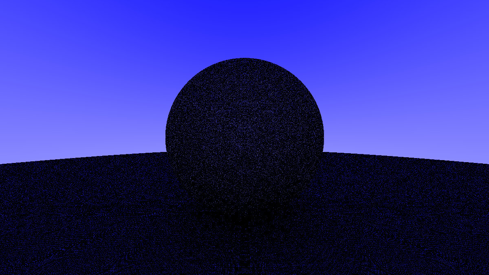

# Raytracer in Rust

1. ## hello world
---

2. ## blue lerp
---

3. ## hit_sphere
---

4. ## hit_sphere_surface_normals
---

5. ## hittable_lists
---

6. ## diffuse_material
---

7. ## shadow_acne
---

8. ## lambertian_reflection
---

9. ## corrected_lambertian_reflection
---

